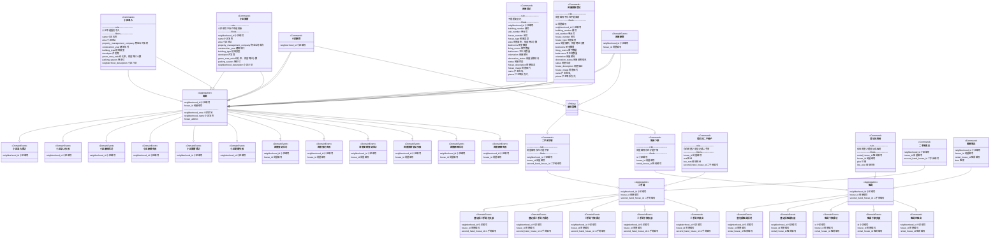

```mermaid
classDiagram

    class 小区录入成功:::DomainEvent {
        <<DomainEvent>>
        neighborhood_id 小区编号
    }

     class 小区录入失败:::DomainEvent {
        <<DomainEvent>>
        neighborhood_id 小区编号
    }

    class 小区删除成功:::DomainEvent {
        <<DomainEvent>>
        neighborhood_id 小区编号
    }

    class 小区删除失败:::DomainEvent {
        <<DomainEvent>>
        neighborhood_id 小区编号
    }

    class 小区更新成功:::DomainEvent {
        <<DomainEvent>>
        neighborhood_id 小区编号
    }

    class 小区更新失败:::DomainEvent {
        <<DomainEvent>>
        neighborhood_id 小区编号
    }

    class 房屋删除:::Command {
        <<DomainEvent>>
        neighborhood_id 小区编号
        house_id   房屋编号
    }

    class 房屋删除成功:::DomainEvent {
        <<DomainEvent>>
        neighborhood_id 小区编号
        house_id   房屋编号
    }

     class 房屋删除失败:::DomainEvent {
        <<DomainEvent>>
        neighborhood_id 小区编号
        house_id   房屋编号
    }

    class 房屋登记成功:::DomainEvent {
        <<DomainEvent>>
        neighborhood_id 小区编号
        house_id   房屋编号
    }

    class 房屋登记失败:::DomainEvent {
        <<DomainEvent>>
         neighborhood_id 小区编号
        house_id   房屋编号
    }

    class 房屋更新登记成功:::DomainEvent {
        <<DomainEvent>>
        neighborhood_id 小区编号
        house_id   房屋编号
    }

    class 房屋更新登记失败:::DomainEvent {
        <<DomainEvent>>
        neighborhood_id 小区编号
        house_id   房屋编号
    }

    class 登记成二手房子成功:::DomainEvent {
        <<DomainEvent>>
        neighborhood_id 小区编号
        house_id   房屋编号
        second_hand_house_id  二手房编号
    }

    class 登记成二手房子失败:::DomainEvent {
        <<DomainEvent>>
        neighborhood_id 小区编号
        house_id   房屋编号
        second_hand_house_id  二手房编号
    }

    class 登记成租房成功:::DomainEvent {
        <<DomainEvent>>
        neighborhood_id 小区编号
        house_id   房屋编号
        rental_house_id  租房编号
    }

    class 登记成租房失败:::DomainEvent {
        <<DomainEvent>>
        neighborhood_id 小区编号
        house_id   房屋编号
        rental_house_id  租房编号
    }

    class 小区录入:::Command {
        <<Command>>
        ------------------rule-------------------
        小区不能重复录入
        ------------------fileds-----------------
        name 小区名称
        area 小区地址
        property_management_company 物业公司名称
        construction_year 建筑年代
        building_type 建筑类型
        developer 开发商
        green_area_ratio 绿化率，保留两位小数
        parking_spaces 停车位
        neighborhood_description 小区介绍
    }

    class 小区删除:::Command {
        <<Command>>
        neighborhood_id 小区编号
    }

    class 小区更新:::Command {
        <<Command>>
        ------------------rule-------------------
        小区编号不存在不能更新
        ------------------fileds-----------------
        neighborhood_id 小区编号
        name 小区名称
        area 小区地址
        property_management_company 物业公司名称
        construction_year 建筑年代
        building_type 建筑类型
        developer 开发商
        green_area_ratio 绿化率，保留两位小数
        parking_spaces 停车位
        neighborhood_description 小区介绍
    }


    class 房屋登记:::Command {
        <<Command>>
        ------------------rule-------------------
        不能重复登记
        ------------------fileds-----------------
        neighborhood_id 小区编号
        building_number 楼号
        unit_number 单元号
        house_number 房号
        house_type 房屋类型
        area 房屋面积，保留两位小数
        bedrooms 卧室数量
        living_rooms 客厅数量
        bathrooms   卫生间数量
        orientation 房屋朝向
        decoration_status  房屋装修情况
        status  房屋状态
        house_description  房屋描述
        house_image 房屋图片
        name 户主姓名,
        phone 户主联系方式,
    }

    class 房屋更新登记:::Command {
        <<Command>>
        ------------------rule-------------------
        房屋编号不存在不能更新
        ------------------fileds-----------------
        id  房屋编号
        neighborhood_id 小区编号
        building_number 楼号
        unit_number 单元号
        house_number 房号
        house_type 房屋类型
        area 房屋面积，保留两位小数
        bedrooms 卧室数量
        living_rooms 客厅数量
        bathrooms   卫生间数量
        orientation 房屋朝向
        decoration_status  房屋装修情况
        status  房屋状态
        house_description  房屋描述
        house_image 房屋图片
        name 户主姓名,
        phone 户主联系方式,
    }


    class 二手房下架:::Command {
        <<Command>>
        ------------------rule-------------------
        房屋编号存在才能下架
        ------------------fileds-----------------
        neighborhood_id 小区编号
        house_id   房屋编号
        second_hand_house_id 二手房编号
    }


    class 二手房下架成功:::DomainEvent {
        <<DomainEvent>>
        neighborhood_id 小区编号
        house_id   房屋编号
        second_hand_house_id 二手房编号
    }

    class 二手房下架失败:::DomainEvent {
        <<DomainEvent>>
        neighborhood_id 小区编号
        house_id   房屋编号
        second_hand_house_id 二手房编号
    }

    class 租房下架成功:::DomainEvent {
        <<DomainEvent>>
        id  小区编号
        house_id   房屋编号
        rental_house_id 租房编号
    }

    class 租房下架失败:::DomainEvent {
        <<DomainEvent>>
        id  小区编号
        house_id   房屋编号
        rental_house_id 租房编号
    }

    class 租房下架:::Command {
        <<Command>>
        ------------------rule-------------------
        房屋编号存在才能下架
        ------------------fileds-----------------
        id  小区编号
        house_id   房屋编号
        rental_house_id 租房编号
    }


    class 登记成二手房子:::Command {
        <<Command>>
        ------------------rule-------------------
        存在房屋才能登记成二手房
        ------------------fileds-----------------
        house_id 房屋编号
        rent 租金
        low_rent 最低租金
        second_hand_house_id 二手房编号
    }


    class 登记成租房:::Command {
        <<Command>>
        ------------------rule-------------------
        存在房屋才能登记成租房
        ------------------fileds-----------------
        rental_house_id 租房编号
        house_id 房屋编号
        pice 价格
        low_pice 最低价格
    }


class 房源:::Aggregation {
    <<Aggregation>>
    neighborhood_id 小区编号
    house_id   房屋编号
    -----------------------------------------------
    neighborhood_area 小区区域
    neighborhood_name 小区名称
    house_addres
}

小区录入 --|> 房源
小区录入 --|> 房源
房源 --|> 小区录入成功
房源 --|> 小区录入失败

小区删除 --|> 房源
小区删除 --|> 房源
房源 --|> 小区删除成功
房源 --|> 小区删除失败

小区更新 --|> 房源
小区更新 --|> 房源
房源 --|> 小区更新成功
房源 --|> 小区更新失败

房屋登记 --|> 房源
房屋登记 --|> 房源
房源 --|> 房屋登记成功
房源 --|> 房屋登记失败

房屋更新登记 --|> 房源
房屋更新登记 --|> 房源
房源 --|> 房屋更新登记成功
房源 --|> 房屋更新登记失败

房屋删除 --|> 房源
房屋删除 --|> 房源
房源 --|> 房屋删除成功
房源 --|> 房屋删除失败

class 二手房:::Aggregation {
    <<Aggregation>>
    neighborhood_id 小区编号
    house_id   房屋编号
    second_hand_house_id  二手房编号
}

登记成二手房子 --|> 二手房
二手房 --|> 登记成二手房子失败
二手房 --|> 登记成二手房子成功
二手房下架 --|> 二手房
二手房 --|> 二手房下架成功
二手房 --|> 二手房下架失败

class 租房:::Aggregation {
    <<Aggregation>>
    neighborhood_id 小区编号
    house_id   房屋编号
    second_hand_house_id  二手房编号
}

登记成租房 --|> 租房
租房 --|> 登记成租房成功
租房 --|> 登记成租房失败

租房下架 --|> 租房
租房 --|> 租房下架成功
租房 --|> 租房下架失败


class 二手房卖出:::Command {
    <<Command>>
    neighborhood_id 小区编号
    house_id   房屋编号
    second_hand_house_id  二手房编号
}

class 二手房已卖出:::DomainEvent {
    <<Command>>
    neighborhood_id 小区编号
    house_id   房屋编号
    second_hand_house_id  二手房编号
}

二手房卖出 --|> 二手房
二手房  --|> 二手房已卖出

class 房屋租出:::Command {
   <<Command>>
    neighborhood_id 小区编号
    house_id   房屋编号
    rental_house_id  租房编号
    time 租期
}

class 租房已租出:::DomainEvent {
    <<Command>>
    neighborhood_id 小区编号
    house_id   房屋编号
    rental_house_id  租房编号
}


房屋租出 --|> 租房
租房  --|> 租房已租出

class 删除策略:::Policy {
    <<Policy>>
}

删除策略 --|> 二手房下架
删除策略 --|> 租房下架

小区删除 --|> 删除策略
房屋删除 --|> 删除策略


```
